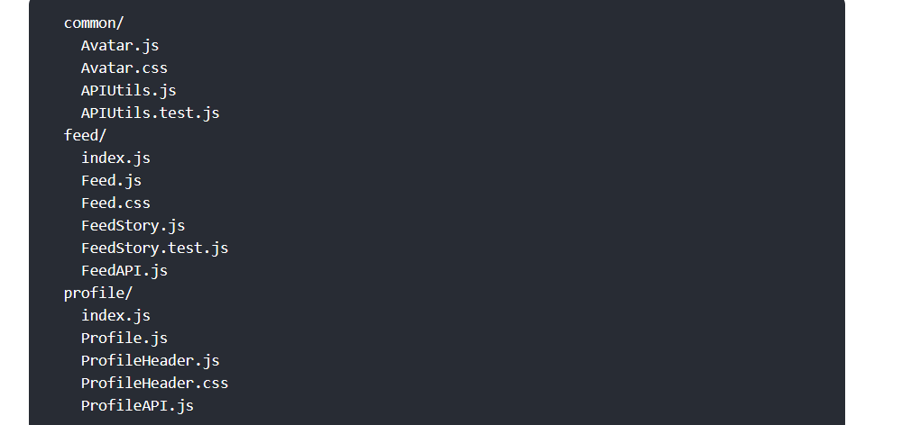
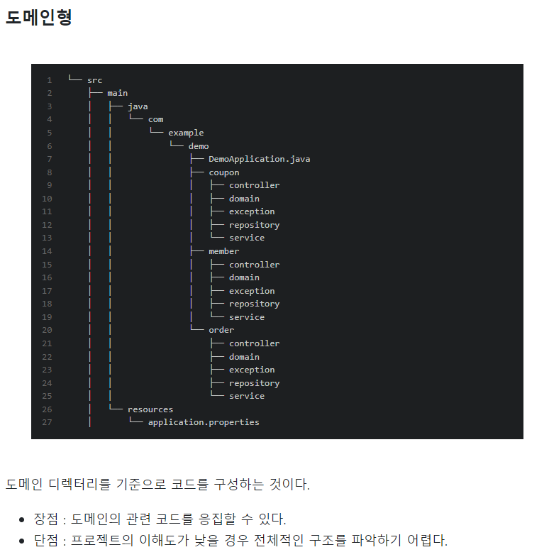
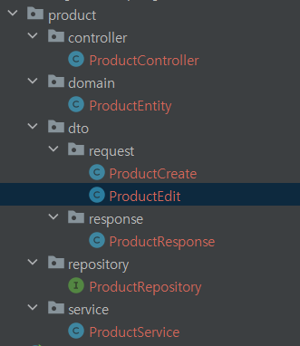

# 코딩 컨벤션

## FrontEnd

- 디렉토리 구조 (React)
    - [파일 구조 – React (reactjs.org)](https://ko.reactjs.org/docs/faq-structure.html) ← 공식 문서
    - 정해진 구조는 없으나 공식 문서에서 추천하는 방식들
        1. 기능 또는 경로 별 그룹화
            
            
            
        2. 파일 유형별 그룹화
            
            
            
            1. 추가적으로 역할에 따라 컴포넌트를 다른 폴더로 분리할 수도 있다.
    - 디렉토리의 depth가 너무 깊어지는(중첩이 너무 많아지는) 경우는 지양


- 변수
    - var 사용 금지 let, const 사용
    - 문자열의 경우 single quote(’ ’) 사용
    - Boolean 값인 경우 is를 접두사로 붙인다
        
        ```jsx
        const isAdmin = true;
        ```
        
- 함수
    - 동사 혹은 전치사로 시작
        
        ```jsx
        function sumAgeAndHeight() {};
        function toConstArray() {};
        ```
        
- 네이밍
    - PascalCase - 컴포넌트명
    - camelCase - 변수명, 함수명, Props, Hook
    - UPPER_SNAKE_CASE - 내부값이 변하지 않는 리스트(tuple), 상수(const)
- 들여쓰기
    - tab = 띄어쓰기(space bar) * 4
    - 스코프마다 tab 1번씩 들여쓰기
- 중괄호
    - 한 줄만 들어가도 생략 X
    - 중괄호(줄바꿈 X)
        
        ```jsx
        if(true) {
        	console.log('hello react');
        }
        
        if(true)
        {
        	console.log('bad case');
        }
        
        ```
        
- 주석
    - 주석 및 디버깅용 console.log는 최종 제출 때 삭제(그전까진 유도리있게 commit)
    - 컴포넌트 앞에서는 **/* 주석 */** 으로 컴포넌트 설명, 내부에서는 **// 주석**
        
        ```jsx
        /**
         * 
         * @param {string} title - set title of modals 
         * @returns React.Components
         */
        
        const BasicModal = ({title , description , buttonText , onButtonClick , modalState , setModalState}) => {
            return (
                    modalState ? <Layout>
                    <Container>
                        <Title>{title}</Title>
                        <Description>{ description}</Description>
                        <Button onClick={() => {
                            onButtonClick()
                            setModalState(false)
                        } }>
                            {buttonText}
                        </Button>
                    </Container>
                </Layout> : null
                
            )
        }
        ```
        
        
        
- 컴포넌트 형태(함수, 클래스)
    - 함수형 컴포넌트 사용을 Default로
    - 함수형에서 구현 불가한 기능은 클래스 컴포넌트 일부 사용
- 이벤트 핸들러 네이밍
    - camelCase로 작성
    
    ```jsx
    <button onclick="activateLasers()"> // 기존 Vue 방식
      Activate Lasers
    </button>
    								↓
    
    <button onClick={activateLasers}> // React 방식
      Activate Lasers
    </button>
    ```
    
- 문법 관련 규칙
    
    [GitHub - tipjs/javascript-style-guide: Airbnb JavaScript 스타일 가이드 한국어](https://github.com/tipjs/javascript-style-guide)
    

## BackEnd

**네이밍**

- 변수
    - camelCase
    - boolean 자료형인 경우 is를 접두사로 붙인다.
    - 최대한 의미를 살려서 작성하기
        
        ```java
        boolean isEmpty = true;
        ```
        
- 상수
    - UPPER_SNAKE_CASE
        
        ```java
        final int MAX_NUM = Integer.MAX_VALUE;
        ```
        
- 메서드
    - camelCase
    - 동사 혹은 전치사로 시작
    - 최대한 의미를 살려서 작성하기
        
        ```java
        public void sumAgeAndHeight() {};
        public String toConstArray() {};
        ```
        
- 클래스, 인터페이스
    - PascalCase
    - 클래스는 명사로 시작, 인터페이스는 명사/형용사로 시작
        
        ```java
        class Product {}
        interface Lendable {}
        ```
        
- 패키지명
    - 영문 소문자로만 사용
        
        ```java
        package com.ssafy.model.helloworld;
        ```
        
- 스프링부트 디렉토리 구조
    - **도메인형으로 사용**
    
    
    
    
    
- 들여쓰기
    - tab = 띄어쓰기(space bar) * 4
    - 스코프마다 tab 1번씩 들여쓰기
- 주석
    - 최대한 함수명, 변수명을 직관적으로 짓기
    - 주석 및 디버깅용 System.out.println()은 최종 제출 때 삭제(그전까진 유도리있게 commit)
    - 주석 기재 시 메소드 앞에서 **/* 주석 */** 으로 메소드 설명, 내부에서는 **// 주석**
- 로깅
    - **Logger에서는 `+` 를 이용해서는 안된다 → `{}` 를 이용할 것**
        
        ```java
        log.info([메소드명] memberDto = {}, memberDto);
        ```
        
    - **Logger Level**
        - **`FATAL`**: X
        - **`ERROR`**: 의도하지 않은 오류 발생 (즉시 알림 필요 - 문자, 카카오톡, 텔레그램 등)
        - **`WARN`**: X
        - **`INFO`**: 서비스 동작 상태
        - **`DEBUG`**: 개발자 필요 (Dev 존에서만 사용)
        - **`TRACE`**: X
- JPA 관련
    - 테이블 명 : 소문자, 복수형 사용
    - Entity 는 Java beans 규약을 지킬 것(lombok 사용 권장)
        - class 는 인자(Argument)가 없는 기본 생성자(Default Constructor)를 갖는다.
        - class 의 멤버 변수는 Property라고 하며 private 접근 제한자를 가져야 한다.
        - class 의 property 들은 Getter/Setter를 통해 접근 할 수 있어야 한다.
            - Getter 의 경우 파라미터가 존재하지 않아야 하며, setter 의 경우 하나 이상의 파라미터가 존재한다.
            - Read-Only 인 경우 Setter 는 없을 수 있다.
        - property의 타입이 boolean 인 경우 is로 시작할 수 있다.
    - 칼럼
        - auto increment 속성의 PK를 대리키로 사용하는 경우, ***"테이블*** ***이름_id"***의 규칙으로 명명한다.
        - 이름을 구성하는 각각의 단어를 snake case를 사용한다.
        - foreign key 컬럼은 부모 테이블의 primary key 컬럼 이름을 그대로 사용한다.
        - self 참조인 경우, primary key 컬럼 이름을 그대로 사용한다.
        - 같은 primary key 컬럼을 자식 테이블에서 2번 이상 참조하는 경우, primary key 컬럼 이름 앞에 적절한 접두어를 사용한다.
        - boolean 유형의 컬럼이면 "_flag" 접미어를 사용한다.
        - date, datetime 유형의 컬럼이면 "_date" 접미어를 사용한다.
- Reference
    
    [9. Naming Conventions](https://www.oracle.com/java/technologies/javase/codeconventions-namingconventions.html)
    

## Github


- Reference
    
    [](https://t1.kakaocdn.net/service_if_kakao_prod/file/file-1636525934056)
    
    [게으른 개발자](https://trustyoo86.github.io/github/2019/02/15/github-template.html)
